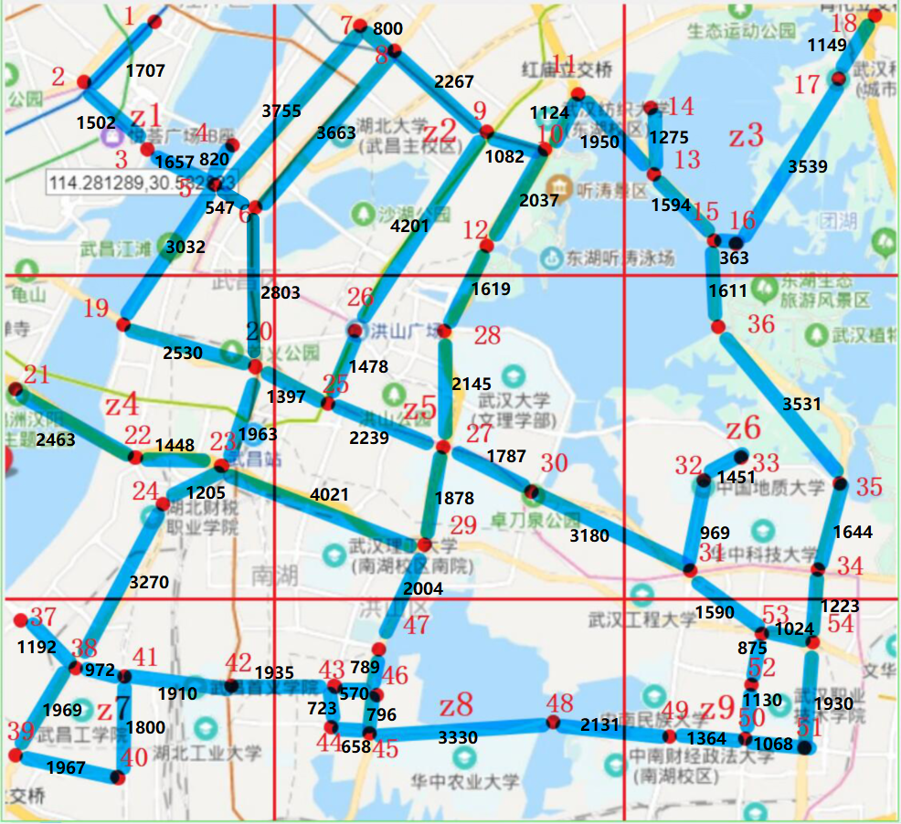

# pRide_impl_repo
pRide论文的复现

下面附一张我们的仿真地图




# 2020.1.28~2020.4.26

基本实现了pRIDE论文中，所构思的方法。

```java
//      ################################ 下面开始初始化四方 
        //计算第三方
        CP cp=new CP();
        //服务商
        ORH orh=new ORH(cp.getPublicKey());
        //乘客 PointA是邻接的第一个点,PointB是邻接的第二个点,PointNow2A_len是乘客到第一个点的距离
        Rider rider=new Rider(33,33,1,pG,26,27,1000,cp.getPublicKey());
        //司机
        Driver driver1=new Driver(44,44,pG,12,14,1300,cp.getPublicKey());
        Driver driver2=new Driver(55,55,pG,20,21,1301,cp.getPublicKey());

        //路网比较，这是直接比较。没有混淆电路、同态加密、没有全流程的
		      Road_map_compare(pG,rider.getRE_Graph_int(),driver1.getRE_Graph_int(),driver2.getRE_Graph_int());

//      ################################ 以下为加入了混淆电路的比较全流程！！ 

        //首先，ORH计算pb
        BigInteger[] pb1=orh.calc_Pd(cp,rider.getRE_Graph_Cipher(),driver1.getRE_Graph_Cipher(),driver1.getMu_Cipher());
        BigInteger[] pb2=orh.calc_Pd(cp,rider.getRE_Graph_Cipher(),driver2.getRE_Graph_Cipher(),driver2.getMu_Cipher());
        //ORH将pb发给cp解密
        cp.get_garbled_value(pb1,driver1.getMu_Cipher(),pb2,driver2.getMu_Cipher());
        //ORH从cp处获得混淆值到混淆pb判断两个司机哪个离乘客近
        orh.gc_compare_2(cp,pb1,driver1.getMu_Cipher(),pb2,driver2.getMu_Cipher());
```


# 2020.4.28

上传项目中，所涉及到的pdf文档

- 1-路网嵌入介绍.pdf
- 2-pRIDE具体方案.pdf
- 3-这是一篇关于pRIDE所用技术的检索结果.pdf

